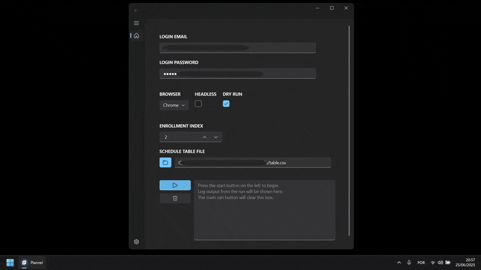

# Time to plan 🕑📅

Using Plannei, our _state of the art_ schedule automater, you can ensure you get the best possible schedules for your classes at the [University of Coimbra](https://www.uc.pt).

The app runs a self-managed browser that will seamlessly interact with our student portal, [nonio](https://xws.pt/nonio), to automatically fill in the data to get your perfect schedule, based on the preferences you give it throught a spreadsheet.

You can now be the biggest nerd on the block and get the schedule you want as soon as the enrollment period opens, leaving your colleagues in the dust.

_NEI/AAC is not responsible for you losing your perfect schedule due to issues with the app. Because of the way the app interacts with the nonio portal, minimal updates/changes to the website layout by the creators may break functionality. We kindly ask you to report any issues you encounter as soon as possible, so we can update our implementation._



## Usage 🚀

- The app is automatically built by a pipeline with every release, so we provide **direct download links** for most operating systems.

- If you run into issues with the downloads below, or if the app does not launch, you can always run it as a developer using [these](#development-%EF%B8%8F) instructions. It's especially easy if you already have Python installed!

- Detailed usage instructions can be found in the [wiki](https://github.com/NEIAAC/plannei/wiki) page.

- See the [example](./example/) directory for demo files.

- ### Windows 🪟

  - [Use this link to start the download.](https://github.com/NEIAAC/plannei/releases/latest/download/Windows.zip)

  - Start the `exe` file **inside** the extracted folder by _double clicking_ on it, you can create a shortcut with any name you like for this file.

  - If you get a message from Windows with a warning that blocks the app from running, add it as a security exception.

- ### Linux 🐧

  - [Use this link to start the download.](https://github.com/NEIAAC/plannei/releases/latest/download/Linux.zip)

  - Start the `bin` file **inside** the extracted folder, remember to **update the execution permissions** first by opening a terminal and running:

      ```shell
      chmod +x <name>.bin
      ./<name>.bin
      ```

  - This binary has been successfully tested on Ubuntu and Arch with both the Wayland and X11 protocols, other setups may need additional tinkering.

- ### MacOS 🍎

  - [Use this link to start the download.](https://github.com/NEIAAC/plannei/releases/latest/download/MacOS.zip)

  - Start the extracted bundle `app` by _clicking_ on it.

  - You may need to add the app as a security exception, for that you can follow [this support page](https://support.apple.com/guide/mac-help/open-a-mac-app-from-an-unknown-developer-mh40616/mac).

## Development 🛠️

- ### Requirements 📋

  - Python 3.12.0+

- ### Setup ⚙️

  - Clone the repository and open a terminal **inside** it.

  - Install the dependencies:

    ```shell
    # It is it recommend that a virtual environment is set before doing this!

    pip install .
    ```

  - Start the app:

    ```shell
    python src/main.py
    ```

  - The app will create and store logs in a diretory determined by `QStandardPaths.StandardLocation.GenericConfigLocation/AUTHOR_NAME/EXECUTABLE_NAME` which is OS independent.
  These logs can be requested from users to get data on why things are not working. Running the binary with the `--debug` flag will increase the verbosity of the logs, for more detailed information.

- ### Tooling 🧰

  - Mypy is used for type checking:

    ```shell
    pip install .[lint]
    mypy src/main.py
    ```

  - Ruff is used as a linter and formatter:

    ```shell
    pip install .[lint]
    ruff check --fix
    ruff format

    # To automatically lint and format on every commit install the pre-commit hooks:
    pre-commit install

    # When using pre-commit hooks, git commands may fail if any files are checked with errors.
    # Changed files must be added to the staged area and commited again to apply fixes.
    ```

- ### Testing 🧪

  - PyTest and PyTest-Qt are used for testing:

    ```shell
    pip install .[test]
    pytest
    ```

- ### Building 📦

  - Nuitka is used for cross-compiling to all supported platforms, this is how the app is built from the source code, in each release:

    ```shell
    pip install .[build]
    nuitka <options> src/main.py
    ```

    See the [deploy workflow](./.github/workflows/deploy.yaml) for a list of options used for each platform.
